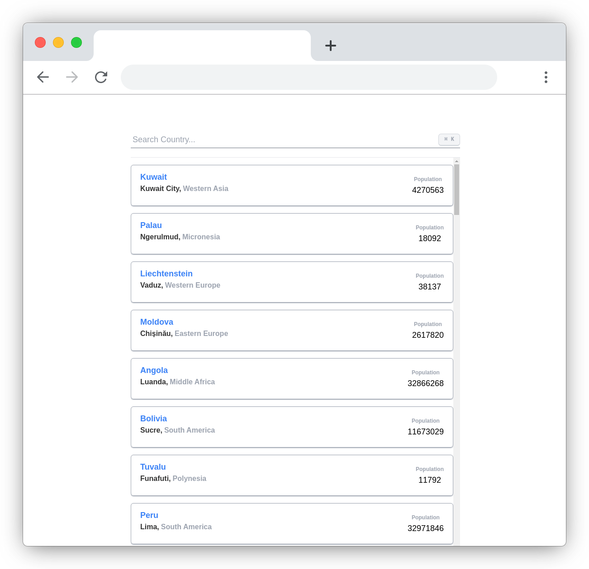
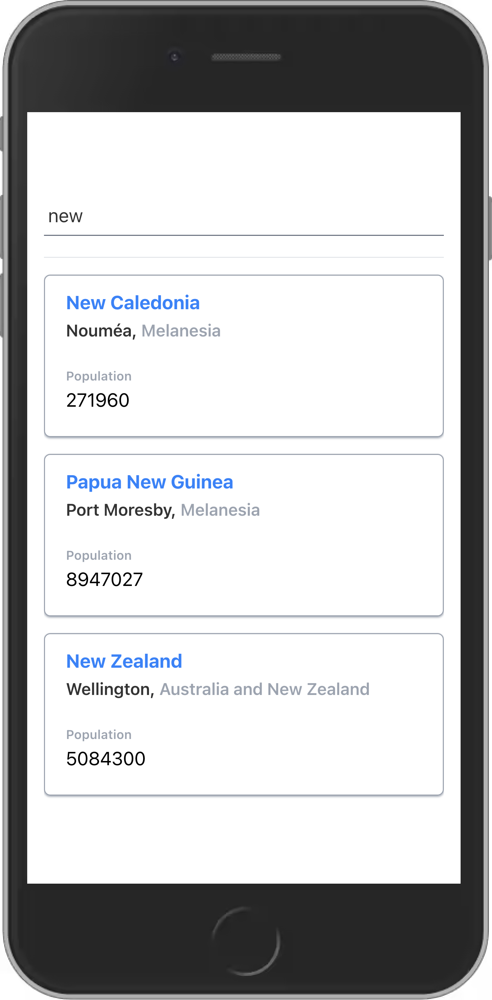
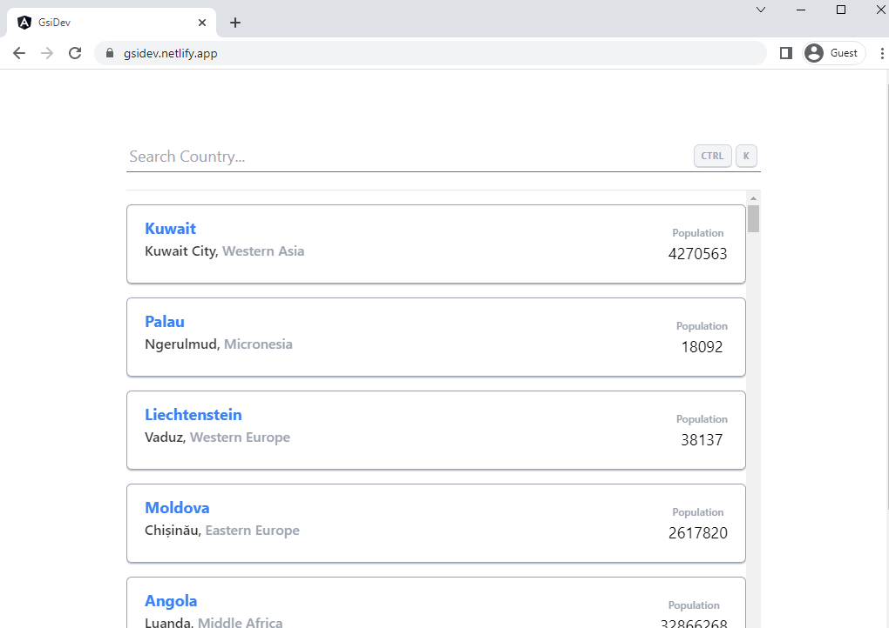

# GSI Frontend Coding Test

A brief description of what this project does is showing list of countries from `restcountries.com/v3.1/all` api and searching list by country name. Developed to apply Senior Frontend Developer position for Allianz Technology.  

---
This project was generated with [Angular CLI](https://github.com/angular/angular-cli) version 14.1.0.

## Run Locally

Clone the project

```bash
  git clone git@github.com:myatthu-mm/gsi-dev.git
```

Go to the project directory

```bash
  cd gsi-dev
```

Install dependencies

```bash
  npm install
```

## Development server

Run `ng serve` for a dev server. Navigate to `http://localhost:4200/`. The application will automatically reload if you change any of the source files.

Start the server

```bash
  ng serve
```

## Run linting application code

`ng lint` run the linting tool on application code. It checks the code quality of angular project specified.

```bash
  ng lint
```
## Running unit tests

Run `ng test` to execute the unit tests via [Karma](https://karma-runner.github.io).
```bash
  ng test
```

## Build

Run `ng build` to build the project. The build artifacts will be stored in the `dist/gsi-dev` directory.
Build the project
```bash
  ng build
```

## Deployment

This is [how to deploy step by step](https://javascript.plainenglish.io/how-to-deploy-angular-app-on-netlify-215aad88505)


---
## Features

- Displaying list of countries
- Filtering list by country name keyword
- Platform responsive and detection
- Cross platform keyboard shortcut


## Demo

[Preview Link](https://gsidev.netlify.app/)

## API Reference

#### Get all list of countries

```http
  GET /restcountries.com/v3.1/all
```

## Screenshots








---

## Tech Stack

**Framework:** Angular 14.1

**UI Library:** TailwindCSS, Angular CDK

**State Management:** Akita

**Unit Test:** Jasmine & Karma


## Lessons Learned

> TailwindCSS and Akita state management are the technologies that I use for the first time. 

> TailwindCSS is highly customizable, developer-friendly utility pattern, enables complex responsive layouts, lightweight and can be optimized using PurgeCSS.

> Akita is easy to pickup, based on object-oriented design principles, fasinatic state management pattern, plugin's  cli and build-in query methods. It is saves the writing boilerplate code to manage application state. I feel right at home with my OOP experience. As my personal point of view, documentation is not solid enough.


## Documentation

I used separated components: Search UI Component & Country Item Component

```typescript
<app-search-ui (filterEvent)="onFilter($event)"></app-search-ui>

<app-country [country]="data"></app-country>
```

To speed up application list view performance, I used Angular CDK Virtual Scorlling.
```typescript
<cdk-virtual-scroll-viewport>
  <div *cdkVirtualFor="let data of countries$ | async">
    <app-country [country]="data"></app-country>
  </div>
</cdk-virtual-scroll-viewport>
```

Fetch data from akita's query methods. No calling direct api call.
```typescript
countries$ = this.countryQuery.selectAll();
```

Call api from state service. And save into the state store.
```typescript
class CountryService {
  get() {
    return this.http.get<Country[]>('https://restcountries.com/v3.1/all')
      .pipe(map(countries => countries.map((country, index) => Object.assign(country, { id: index }) )))
      .subscribe(countries => {
      countryStore.set(countries);
    });
  }
}
```

Can know *loading* state and can *filter* by query methods.
```typescript
countryQuery.selectLoading();
countryQuery.selectAll({
  filterBy: [
    (entity: Country) => entity.name.common.toLowerCase().includes(query)
  ]
});
```

Improved user experience with focusing search box by pressing keyboard shortcut implemented `@HostListener` decorator.
```typescript
  @HostListener('document:keydown', ["$event"])
```

Shortcut keys depend on OS and not displaying in small screen like mobile platform (Thanks to Tailwind CSS). CMD + k in Mac and CTRL + k in Windows.
```typescript
type OS = 'Windows' | 'Mac';

<kbd class="invisible lg:visible">
        ⌘ K
</kbd>
```

Improved searching performance when we type search keyword.
Not calling search query in every single keypress and same keyword typing by using rxjs operators below.
```typescript
distinctUntilChanged(),
debounceTime(800)
```

We used custom letter only directive for not to type numeric value in search box.
```typescript
<input #searchInput appLetterOnly>
```
---
# Hi, I'm Myat Thu! 👋

## 🚀 About Me
Currently, I'm a full stack developer in *Yoma Bank*. I do have both frontend and backend development experiences. And also Hybrid mobile development experiences. As a current job domain, I have strong knowledges of the Banking Financial field working as a Fullstack developer using **Angular** as Frontend and **Spring Boot(Java)** as Backend.

## 🔗 Links
[](https://myatthu.hashnode.dev/)
[](https://www.linkedin.com/in/myat-thu-47a973128/)


## 🛠 Skills
JavaScript, HTML, CSS, TypeScript, Java, Angular 2+, Jasmine, Spring Boot, and so on...

## Author

[@myatthu-mm](https://www.github.com/myatthu-mm)


## Feedback

If you have any feedback, please reach out to us at *mt29.myatthu@gmail.com*